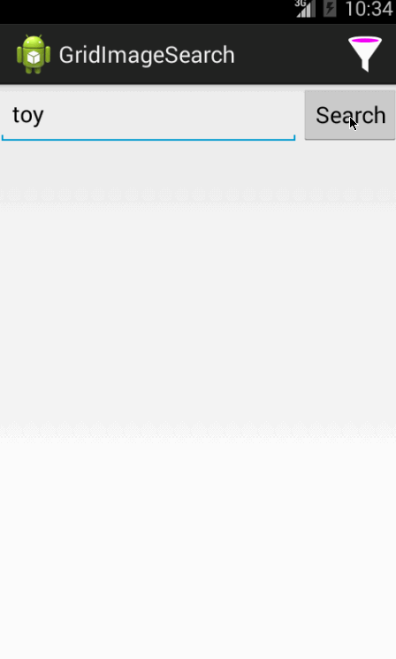
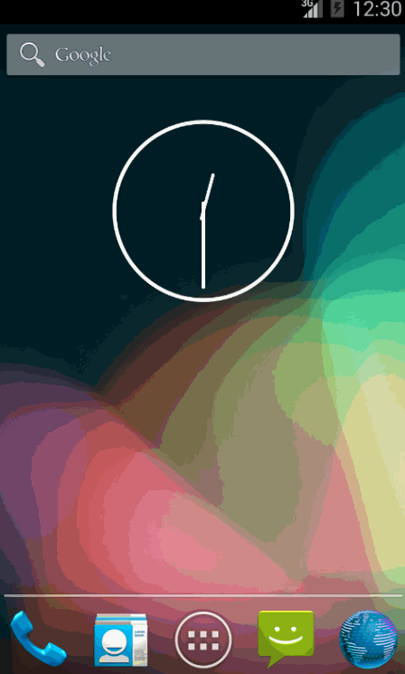

CodePathAndroidBootcampW2
=========================

This is an Android application for the Grid Image Search using the Google Image API, the android-async-http library and the Picasso image library.

**Time spent:**

**Completed user stories in base project (GridImageSearch):**

- [x] User can enter a search query that will display a grid of image results from the Google Image API
- [x] User can click on "settings" which allows selection of advanced search options to filter results
- [x] User can configure (using Spinners) advanced search filters such as:
    - Size (small, medium, large, extra-large)
    - Color filter (black, blue, brown, gray, green, etc...)
    - Type (faces, photo, clip art, line art)
    - Site
- [x] Subsequent searches will have any filters applied to the search results
- [x] User can tap on any image in results to see the image full-screen
- [x] User can scroll down "infinitely" to continue loading more image results (up to 8 pages)

**Walkthrough of base user story (GridImageSearch):**

**Modified the text alignment for the Spinners -> Right Aligned (GridImageSearchRightAlign)**
Same user story hold as above with-

- [x] Text in Spinners is Right Aligned both in Dropdown and in Selected View.

**Modified some basic styling ... Just a little bit of color: (GridImageSearchStyle)**
Same user stoies about hold with-

- [x] Blue camera app icon
- [x] Blue camera Activity Bar Icon and same blue background for Activity Bar
- [x] Matching blue background for Search and Save buttons
- [x] Some padding adding to some elements in Activities

GIFs created with [LiceCap](http://www.cockos.com/licecap/).
